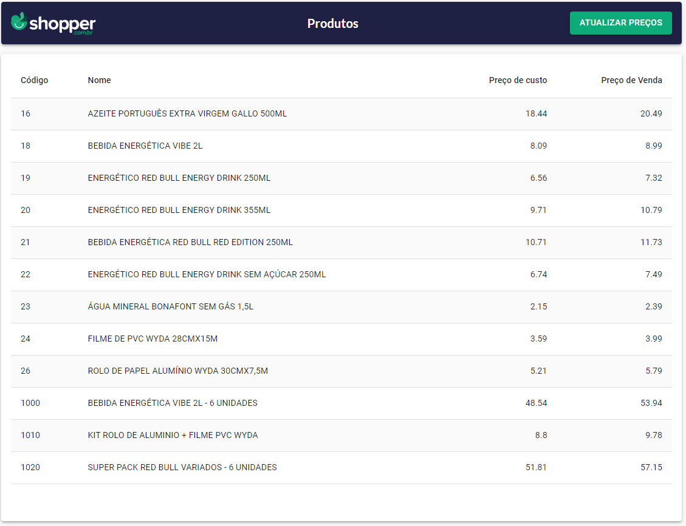

# Shopper-Chalange

Este é um projeto desenvolvido como parte de um desafio técnico para concorrer a uma vaga na empresa Shopper.com.br.



## Sobre o Projeto

O objetivo deste projeto é desenvolver uma ferramenta que permita aos usuários atualizar os preços dos produtos de suas lojas de forma massiva e com recursos adicionais para evitar erros que possam prejudicar o negócio. A ferramenta deve atender aos seguintes requisitos:

- O time Compras gera um arquivo CSV contendo o código do produto e o novo preço que será carregado.
- O time Financeiro solicita que o sistema impeça que o preço de venda dos produtos fique abaixo do custo deles.
- O time de Marketing solicita que o sistema impeça qualquer reajuste maior ou menor do que 10% do preço atual do produto.
- Alguns produtos são vendidos em pacotes, e ao reajustar o preço de um pacote, o arquivo deve conter os reajustes dos preços dos componentes do pacote de modo que o preço final da soma dos componentes seja igual ao preço do pacote.

## Tecnologias Utilizadas

- Back-End: Node.js com TypeScript
- Front-End: React.js com TypeScript
- Banco de Dados: MySQL (versão 8)
- Docker: Utilizado para criar containers para o back-end, front-end e banco de dados.

## Pré-requisitos

Para executar este projeto em sua máquina local, certifique-se de atender ao seguinte requisito:

- [Docker](https://www.docker.com/) instalado e configurado.

## Executando o Projeto

Para iniciar o projeto, siga os passos abaixo:

1. Clone este repositório:

```sh
git clone git@github.com:gleisoncoruja/shopper-chalange.git
```

2. Navegue para o diretório do projeto:

```sh
cd shopper-chalange
```
3. Navegue para o diretório do backend:

```sh
cd backend
```
4. Renomeie o arquivo .env-copy para .env:

Windows
```sh
ren .env-copy .env
```

Linux
```sh
mv .env-copy .env
```
5. Navegue de volta para o diretório principal do projeto:

```sh
cd ..
```

6. Execute o seguinte comando para iniciar o projeto com Docker:

```sh
docker-compose up --build
```

Isso criará os containers necessários e iniciará o projeto.

Aguarde até que todos os containers estejam prontos e o sistema esteja funcionando.

## Uso da Ferramenta

### Frontend

1. Acesse a interface do usuário em seu navegador em [http://localhost](http://localhost).

2. Na página principal, você verá listado todos os produtos.

3. Ao clicar no botão ATUALIZAR PREÇOS, você navegará até a página de atualização de preços, você poderá fazer o upload do arquivo CSV contendo as atualizações de preço dos produtos.

4. Clique no botão "VALIDAR" para verificar se o arquivo está formatado corretamente e atende às regras estabelecidas.

5. Os produtos validados serão exibidos na tela, mostrando o Código, Nome, Preço Atual e Novo Preço. Qualquer regra quebrada será destacada.

6. Se todos os produtos estiverem corretamente validados, o botão "ATUALIZAR" será habilitado.

7. Clique no botão "ATUALIZAR" para salvar os novos preços no banco de dados.

### Backend

O backend é responsável por processar as requisições do frontend, aplicar as regras de validação e atualizar os preços no banco de dados MySQL.

### Banco de Dados

O banco de dados MySQL é usado para armazenar informações sobre produtos e preços. As atualizações de preços serão refletidas no banco de dados.


## Autor

Gleison Souza

## Licença

Este projeto está licenciado sob a Licença MIT - veja o arquivo [LICENSE.md](LICENSE.md) para detalhes.


